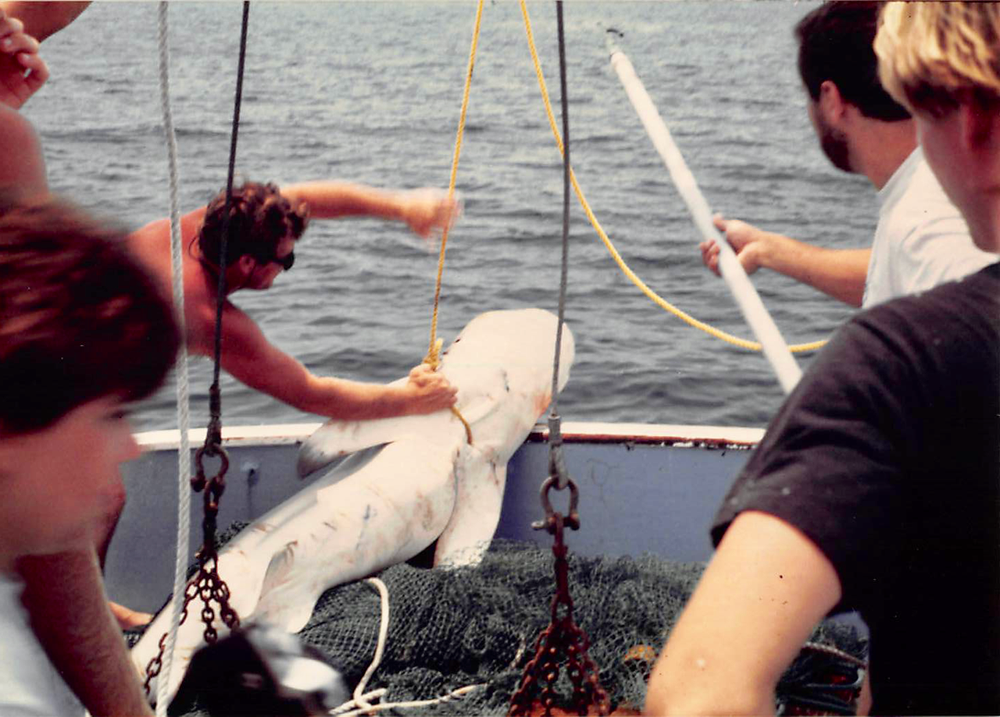
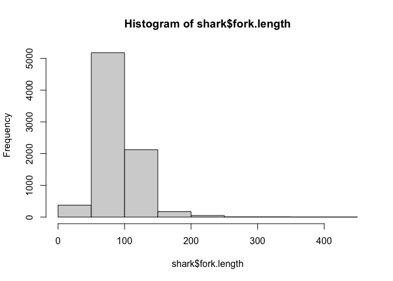
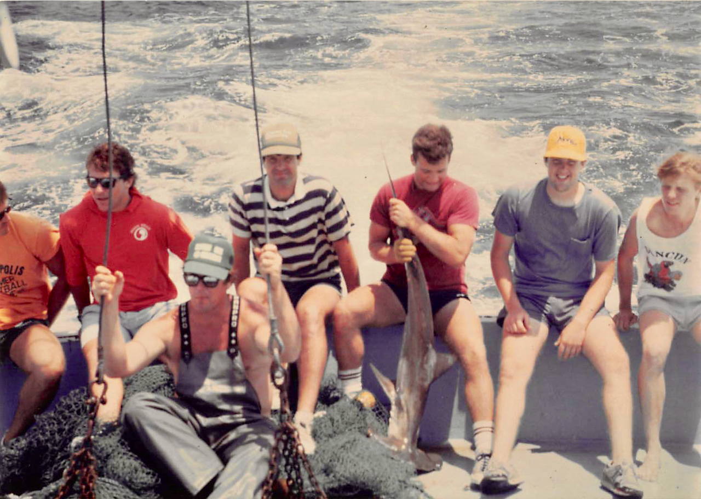

UNC-IMS longline shark survey data, 1972-2006
=============================================

This package contains data from the multi-year longline shark sampling
survey conducted over several decades by Frank J. Schwartz of the UNC
Institute of Marine Sciences.

The data available in the repository are cleaned, curated from the Excel
spreadsheet available at the UNC IMS website. We consider include only a
subset of the data elements. We also merge in daily minimum and maximum
temperature and precipitation measures obtained from NOAA. We use data
from a weather station in Wilmington, NC (GHCND:USC00319467).

Any such use should acknowledge the source as the UNC-IMS longline shark
survey from this website:
<a href="http://ims.unc.edu/home/research/" class="uri">http://ims.unc.edu/home/research/</a>

Installation
------------

You can install the package with the data from bitbucket and then attach
the package

    library("devtools")
    devtools::install_github("alanbrookhart/sharkr")

Codebook
--------

-   date = date shark was captured
-   time = time of day shark was captured
-   tide = high or low tide
-   species = type of shark
-   fork.length = length of shark in cm
-   temp.max = maximum temperature during the day
-   temp.min = minimum temperature durin the day
-   precip = inches of rainfall during the day

Example data
------------

    library(sharkr)
    hist(shark$fork.length)

Data cleaning
-------------

We dropped sharks with fork lengths that were greater than 500cm.

We also dropped records indicating that no sharks were caught on a
particular long line that was deployed.

Information from UNC IMS website
--------------------------------

### Notes

-   The long-term UNC-IMS research survey of sharks has been conducted
    each year since 1972 by Dr. F.J. Schwartz of the University of North
    Carolina at Chapel Hill Institute of Marine Sciences in Onslow Bay
    off the central coast of North Carolina near Cape Lookout. Survey
    methods (Schwartz 1984) have remained identical over a 40-year
    period. Unanchored longlines have been set biweekly from about April
    15 to November 1 (a total of 758 sets from 1972-2003, plus
    additional sets for 2004 - 2011, the additional years posted since
    the initial release of the data) using a design employing the same
    gear at two fixed stations. Prior to setting out the longline, fresh
    fish were collected by trawling and used as whole fish to bait the
    hooks. Two successive sets of baited hooks constituted the sampling
    for every date (except less than one quarter of days when bad
    weather prevented establishment of the second set). Sampling was
    carried out during the day between the hours of 0800 and 1500hr.
-   The East-West set was established first, near shore and
    approximately parallel to the beach of Shackleford Banks in 13 m
    depth, running up to 4.8 km eastward from 34º 38.029’ N, 76º
    37.835’ W. Sets employed between 27 and 483 hooks (mean = 151), with
    one plastic foam international orange buoy of 1.3-m diameter
    attached for every 10 hooks and hooks spaced every 4.5 m.
    Case-hardened steel 9/0 Mustad tuna hooks were attached to 1.8-m
    drop lines of No. 2 (95 kg) porch swing chain, which were snapped
    onto the 7.6-cm braided nylon main line. Soak time after setting was
    1 hr. During the ≈45 min required to pull in the line, the species,
    sex, and fork length of each hooked shark was recorded and all live
    sharks were tagged and returned to the sea. After 35-40 minutes
    travel time, the North-South set was established further offshore in
    Onslow Bay in 22 m depth, running southwards from 34º 33.071’ N, 76º
    37.422’ W. The procedures followed were identical to those of the
    East-West set. Trawling for additional bait was occasionally
    required between sets.
-   Data from 2009 onward report only total number of each species
    (rather than individual sharks) caught on a particular date / time
    and are presented on a separate tab from the 1972 - 2008 data.

### Acknowledgments

-   The collection of these data on shark abundances and sizes in
    coastal Onslow Bay has been supported by Carolina Power and Light in
    early years and by resources of the Institute of Marine Sciences of
    the University of North Carolina at Chapel Hill in all years. The
    chief scientist who ran the survey from its inception is
    Dr. Frank J. Schwartz. Numerous individuals have contributed
    assistance on deck and in the laboratory over the years, far too
    many to identify by name. Some, however, deserve special thanks.
    Captains John Wegner, Otis Lewis, and Joseph Purifoy guided the
    research ships, Machapunga and then Capricorn, from which the survey
    was conducted. Many mates served tirelessly, recently including
    Glenn Safrit, Claude Lewis, Wayne Fluellen, and Stacy Davis. Glen
    Safrit provided many hours of laboratory assistance. The NOAA NMFS
    staff helped organize, code, and verify the data. Kar Howe developed
    the website posting.

### Literature Cited

-   Schwartz, F.J. 1984. Occurrence, abundance, and biology of the
    blacknose shark, Carcharhinus acronotus in North Carolina. Northeast
    Gulf Science 7: 29-46.

### Source

-   Distributed over the website:
    <a href="http://ims.unc.edu/home/research/" class="uri">http://ims.unc.edu/home/research/</a>

Contact
-------

Repository maintained by Alan Brookhart and Sara Levintow

contact:
<a href="mailto:alan@brookhart.org" class="email">alan@brookhart.org</a>
